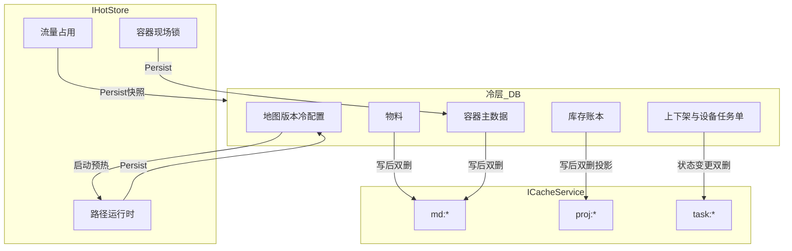
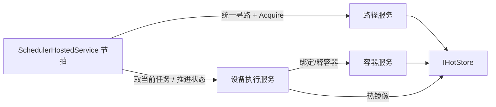
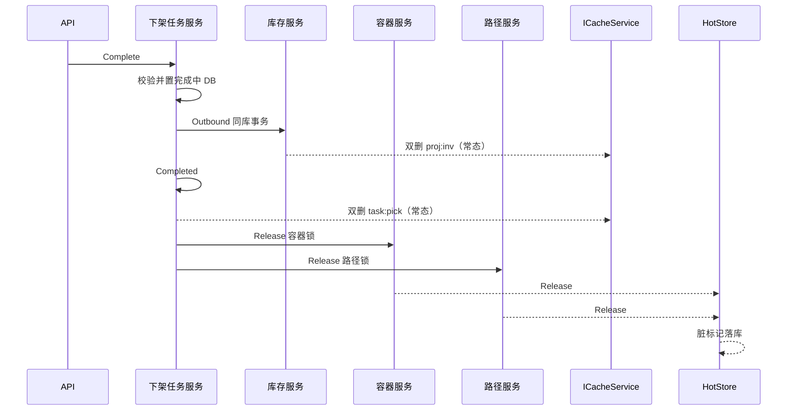

# 仓储业务实体缓存完整实现大纲

状态：草案（已补 §1.5 服务切分与落地口径）  
日期：2026-08-12  
范围：物料主数据、库存、容器、上架任务、下架任务、设备执行任务、路径、流量  

对齐现有能力：

- `ICacheService`：Memory/Redis + 延迟双删（读多写少 / 只读投影）— 见 `doc/02-后端开发指南.md` §6
- `IHotStore`：热层真相源 + 预热 + 异步落库（调度高频态）— 见 `doc/15-热数据HotStore.md`

术语释义见文末 [§17 术语表](#17-术语表)。

---

## 1. 总则

### 1.1 三类通道（禁止混用职责）


| 通道                                     | 真相源     | 适用              | 反模式                    |
| -------------------------------------- | ------- | --------------- | ---------------------- |
| **A. Cache-Aside**（`ICacheService`）    | DB      | 主数据、任务查询视图、低频配置 | 调度节拍每拍双删；用缓存做扣减        |
| **B. 只读投影**（`ICacheService` + `proj:`） | DB      | 库存/任务看板聚合展示     | 分配/预留读投影；写路径 Set 半成品   |
| **C. HotStore**（`IHotStore`）           | 热层（运行期） | 路径占用、流量、容器现场锁   | miss 回库；管理端 CRUD 直接改热态 |


### 1.2 Key 前缀隔离


| 前缀                            | 通道           | 示例                                   |
| ----------------------------- | ------------ | ------------------------------------ |
| `md:`                         | A            | `md:mat:{code}`                      |
| `proj:`                       | B            | `proj:inv:sku:{sku}`                 |
| `task:`                       | A（任务详情/列表片段） | `task:put:{id}`                      |
| `hot:` / 业务短名经 HotStore 自动加前缀 | C            | `wcs:path:{id}`、`wcs:lock:edge:{id}` |


### 1.3 决策矩阵（一览）


| 实体     | 通道             | 写后动作               | 决策路径读哪           |
| ------ | -------------- | ------------------ | ---------------- |
| 物料主数据  | A              | 延迟双删               | 缓存可（miss 回库）     |
| 库存     | B + DB 账本      | 双删投影               | **仅 DB**         |
| 容器·主数据 | A              | 双删                 | 缓存可              |
| 容器·现场态 | C              | 热写 + 落库            | **HotStore**     |
| 上架任务   | A/B（查询）+ DB    | 状态变更双删             | 派发/完成 **仅 DB**   |
| 下架任务   | 同上             | 同上                 | 同上               |
| 设备执行任务 | DB 权威；可选热镜像    | 完成写库；热态可选          | 设备驱动以约定源为准（见 §7） |
| 路径     | C（运行时）+ 冷配置 DB | 热层 Acquire/Release | **HotStore**     |
| 流量     | C              | 热层占道 + 批量落库        | **HotStore**     |


### 1.4 总数据流




### 1.5 服务切分与落地口径（推荐）

**口径一句话：** 一实体一领域服务；正常写路径内嵌通道动作（调用方无感）；异常/运维走显式操作面；调度节拍独立 HostedService，调用设备执行服务与路径服务。

#### 1.5.1 领域服务一览


| 服务          | 权威职责                  | 通道动作（常态，写成功后内嵌）                    | 异常/运维操作面          |
| ----------- | --------------------- | ---------------------------------- | ----------------- |
| **物料主数据服务** | CRUD、查询               | 双删 `md:mat:`*                      | `ForceInvalidate` |
| **库存服务**    | 账本命令 + 投影查询（分门）       | 双删 `proj:inv:`*（仅命令成功后）            | 投影 Rebuild、对账     |
| **容器服务**    | 主数据 CRUD；现场锁 API 单独暴露 | 主数据双删；现场走 HotStore Acquire/Release | 强制释锁、主数据失效        |
| **上架任务服务**  | 状态机；完成联动库存            | 双删 `task:put:`* + 涉及投影             | 强制完成/失败、失效详情缓存    |
| **下架任务服务**  | 同上 + 预留/扣减编排          | 双删 `task:pick:`* + 投影              | 同上                |
| **设备执行服务**  | 任务单生命周期；更新热镜像         | 写 DB + Set/Remove `wcs:dev:*:exec` | 强制失败/重开、回调幂等重放    |
| **路径服务**    | **统一寻路** + 占道/释道；读流量  | HotStore Acquire/Release / 流量更新    | 强制释边/释节点、热冷对账     |


原则：

- **禁止**再做一个「大 EntityCache / 万能基础服务」兼管队列与全实体缓存。
- **流量**可作为路径服务内部模块，或仅由路径服务调用的协作组件；任务服务不得直接改占用。
- 上架/下架是**单据域**：有状态编排，**没有**车/路网调度节拍。


#### 1.5.2 常态 vs 异常（禁止混读）


| 类型          | 何时发生              | 谁触发               | 示例                                                               |
| ----------- | ----------------- | ----------------- | ---------------------------------------------------------------- |
| **常态通道动作**  | 每次业务写成功后          | 领域服务内部自动          | 延迟双删、热镜像更新、占/释锁                                                  |
| **异常/运维操作** | 脏数据、锁泄漏、人工干预、告警补偿 | 运维 API / 补偿作业显式调用 | `ForceInvalidate`、`Reconcile`、`ForceReleaseLock`、`ForceComplete` |


反模式：把写后双删/热写当成「仅异常才做」——依赖纯 TTL 会使脏读成为常态，违背 §1.1 / 各实体写后失效约定。

#### 1.5.3 调度与任务服务边界




| 放在领域服务内                | 放在独立调度宿主               |
| ---------------------- | ---------------------- |
| 状态机、完成联动、异常补偿 API      | 每拍循环、等待 `IsReady`、单活约定 |
| 设备执行：创建/ACK/完成写库 + 热镜像 | 扫描空闲设备、驱动寻路与占道编排       |
| 路径：寻路算法 + 占道原语封装       | 何时对哪台车发起寻路（节拍策略）       |


`SchedulerHostedService` **调用**设备执行服务与路径服务，而不是把节拍循环塞进某一任务服务类内部。

#### 1.5.4 跨服务编排（仍由调用方串联）

典型下架完成：下架任务服务（事务内状态 + 调库存服务）→ Commit 后双删 → 调容器/路径释锁。  
无分布式事务框架；顺序与补偿见 §10。

#### 1.5.5 与薄协调层的关系（可选）

一期可不建独立 `IEntityCacheCoordinator`：失效扇出写在各领域服务内即可。  
若 key 扇出规则膨胀，可抽**仅负责注册表 + Invalidate/Rebuild 钩子**的薄 facade，仍不承载任务队列与业务状态机。

---


## 2. 物料主数据（Material）


### 2.1 业务特征

- 读多写少；被入库推荐、质检规则、包装换算频繁引用。
- 变更少，允许秒级最终一致。


### 2.2 选型

**通道 A：Cache-Aside**，对齐菜单/字典。

### 2.3 Key 与载荷


| Key                     | 内容                      | TTL      |
| ----------------------- | ----------------------- | -------- |
| `md:mat:{materialCode}` | 物料 DTO（规格、单位、ABC、上架策略码） | 1h       |
| `md:mat:list:active`    | 可选：启用物料摘要列表（写多时勿用大 key） | 10–30min |


禁止缓存 EF 跟踪实体；用只读 DTO。

### 2.4 读写

- **读**：`Get` → miss → `AsNoTracking` → `Set`
- **写**（增删改）：`SaveChanges` 成功后 `RemoveWithDelayedDoubleDeleteAsync` 对应 key；若维护列表 key 一并删


### 2.5 实现要点

- Service：`MaterialService`（或 Query/Command 拆分，写后必失效）— 对齐 §1.5
- 配置开关可复用全局 Cache；无需独立 HotStore
- 单测：hit/miss；Update 后 key 不存在
- 运维：可选 `ForceInvalidate(materialCode)`，与业务写路径分路由


### 2.6 交付切片

1. 实体 + CRUD
2. 查询侧缓存
3. 写后双删
4. 文档示例

---


## 3. 库存（Inventory）


### 3.1 业务特征

- 账本强一致：预留/扣减/释放不可超卖。
- 看板、可发量查询可接受短暂陈旧。


### 3.2 选型

- **权威**：DB 事务（`Inv_Balance` + `Inv_Ledger`）
- **缓存**：**通道 B 只读投影**，禁止用投影做 Reserve/Outbound

粒度默认：`SkuCode + LocationCode`（可扩展 Lot/Owner）。

### 3.3 Key 与载荷


| Key                        | 内容                                        | TTL |
| -------------------------- | ----------------------------------------- | --- |
| `proj:inv:bal:{sku}:{loc}` | OnHand/Reserved/Available/AsOfUtc/Version | 15s |
| `proj:inv:sku:{sku}`       | 跨货位汇总                                     | 15s |
| `proj:inv:board:summary`   | 看板（慎用；优先细粒度）                              | 15s |


### 3.4 读写

```
查询 API → ProjectionService → Cache Get
                miss → DB 聚合 → Set(TTL)

命令 API → CommandService → DB 事务（行版本/行锁）
         → Commit 成功 → 双删相关 proj:inv:*
         → 绝不 Set 投影；绝不读投影做决策
```


### 3.5 配置

```json
"Cache": {
  "InventoryProjectionEnabled": true,
  "InventoryProjectionTtlSeconds": 15
}
```


### 3.6 实现要点

- `InventoryCommandService`：Reserve/Release/Adjust/Inbound/Outbound + 幂等键
- `InventoryProjectionQueryService`：仅查询
- API 分路由；单测断言命令路径未 `Get` 投影
- 详见既有方案讨论：短 TTL + 写后双删；一期不做异步 Rebuild


### 3.7 交付切片

1. 账本实体与命令（无缓存可跑通）
2. 投影查询 + TTL
3. 写后失效
4. 指南交叉引用

---


## 4. 容器（Container）


### 4.1 业务特征（拆两态）


| 态       | 内容                | 变更频率     |
| ------- | ----------------- | -------- |
| **主数据** | 类型、容量、条码规则、启用     | 低        |
| **现场态** | 当前位置、空满、绑定任务、锁定占用 | 高（调度/执行） |


### 4.2 选型

- 主数据 → **通道 A**（`md:cont:{code}`）
- 现场占用/锁定 → **通道 C HotStore**（与货位/边锁同类）
- 管理端列表「当前位置」展示：可 DB 或投影；**抢占/绑定以 HotStore 为准**


### 4.3 Key


| Key                       | 通道  | 说明                        |
| ------------------------- | --- | ------------------------- |
| `md:cont:{containerCode}` | A   | 主数据 DTO                   |
| `wcs:cont:{code}`         | C   | 运行时位置/状态快照                |
| `wcs:lock:cont:{code}`    | C   | `TryAcquire`/`Release` 互斥 |


### 4.4 读写

- 主数据：同物料 Cache-Aside + 写后双删
- 现场：调度只打 HotStore；预热从 DB 装入；`TrackingHotStore` 批量落库到容器位置快照表
- **禁止**：现场锁走 `ICacheService` 双删


### 4.5 实现要点

- Warmup：加载在场容器运行态
- Persister：过滤 `wcs:cont:` / `wcs:lock:cont:` 变更 UPSERT
- `AuditExcludeEntities` 加入容器热表短名
- 单活：`HotStore:SingleWriter=true`；多实例用 Redis Provider


### 4.6 交付切片

1. 主数据 CRUD + `md:cont:`
2. HotStore 容器运行态 + Acquire
3. 预热/落库
4. 监控只读 API

---


## 5. 上架任务（Putaway Task）


### 5.1 业务特征

- 单据生命周期：创建 → 分配 → 执行中 → 完成/取消
- 写集中在状态机；列表/详情读多
- **完成时**通常联动库存入库 + 容器位置 — 必须 DB 事务（或可靠消息）


### 5.2 选型

- 任务单权威：**DB**
- 详情/工作台列表片段：**通道 A**（短 TTL）或状态变更后双删
- 推荐空货位等聚合：**通道 B 投影**（可选二期）
- 执行过程占道/占容器：走 **HotStore**（路径/容器），不缓存任务行做占用


### 5.3 Key


| Key                     | TTL    | 失效时机                            |
| ----------------------- | ------ | ------------------------------- |
| `task:put:{taskId}`     | 30–60s | 状态变更、明细变更                       |
| `task:put:open:wh:{wh}` | 15–30s | 任何该仓上架单变更（或不用列表大 key，改为分页直查 DB） |


一期建议：**只缓存单任务详情**；开放列表直查 DB，避免大 key 失效风暴。

### 5.4 读写

- 查询详情：Cache-Aside
- 创建/指派/完成/取消：DB 状态机；Commit 后双删 `task:put:{id}`
- `Complete`：同事务写库存账本 → 再双删 `proj:inv:*` 与任务 key


### 5.5 实现要点

- 明确状态枚举与合法迁移
- 完成路径集成 `InventoryCommandService`（入库）
- 不把「待上架数量」放在可写缓存计数器


### 5.6 交付切片

1. 任务状态机 + DB
2. 详情缓存
3. 完成联动库存与缓存失效
4. （可选）推荐货位投影

---


## 6. 下架任务（Pick / Outbound Task）


### 6.1 业务特征

- 与上架对称；完成时常含 **预留释放 + 扣减**
- 分配波次时易并发抢同一库存行 → 必须以库存命令服务为准


### 6.2 选型

同 §5：DB 权威 + 详情短缓存 + 完成联动库存双删投影。

### 6.3 Key


| Key                  | 说明      |
| -------------------- | ------- |
| `task:pick:{taskId}` | 详情      |
| 波次/工作台               | 一期直查 DB |


### 6.4 关键顺序（完成）

```
Begin Tx
  校验任务状态
  Inventory.Outbound / Release（账本）
  更新任务 Completed
Commit
双删 task:pick:{id}
双删 proj:inv:*（涉及 SKU/货位）
释放 HotStore 容器/路径锁（若持有）
```


### 6.5 实现要点

- 分配阶段调用 `Reserve`（DB），禁止读 `proj:inv` 决定能否下架
- 波次并发：库存行版本冲突返回可重试错误


### 6.6 交付切片

同 §5，另加重预留/扣减单测与并发用例。

---


## 7. 设备执行任务（Device Execution Task）


### 7.1 业务特征

- WCS/设备驱动：下发、ACK、运行中、完成、失败/重试
- 状态变更频率高于人工单据，但仍低于路径节拍
- 常关联路径占用与容器锁


### 7.2 选型（固定一期策略）


| 数据              | 策略                                                 |
| --------------- | -------------------------------------------------- |
| 任务单头/历史         | **DB 权威**                                          |
| 设备当前执行指针（正在跑哪条） | **HotStore 可选镜像** `wcs:dev:{deviceId}:exec`，落库节拍同步 |
| 人工监控列表          | DB 分页；或短 TTL `task:dev:{id}`                       |


**一期默认**：设备执行任务以 **DB 为派发与完成的权威**；HotStore 仅存「设备当前任务 Id + 阶段」便于调度每拍读取，避免每拍打库。任务创建/完成仍写 DB，并 `Set`/`Remove` 热镜像。

### 7.3 Key


| Key                       | 通道        |
| ------------------------- | --------- |
| `task:dev:{execId}`       | A（详情，可选）  |
| `wcs:dev:{deviceId}:exec` | C（当前执行快照） |


### 7.4 读写

- 调度每拍：读 HotStore 当前执行；无则视为空闲（可回源 DB 一次并回填热层）
- 状态推进：写 DB → 更新热镜像 → 必要时占/释路径与容器锁
- 崩溃恢复：Warmup 从 DB「执行中」任务重建 `wcs:dev:*:exec`


### 7.5 实现要点

- 与路径/流量同一 `Features.HotStore` 生命周期（`IsReady` 后再调度）
- Persister 可合并设备快照表；审计排除热表
- 幂等：设备回调带 `ExecId + EventSeq`
- **边界（§1.5.3）**：状态机与热镜像在设备执行服务内；每拍循环在 `SchedulerHostedService`，由其调用本服务 + 路径服务


### 7.6 交付切片

1. 执行任务表与状态机（DB）
2. 热镜像 + Warmup
3. 与路径 Acquire 编排
4. 回调幂等

---


## 8. 路径（Path）


### 8.1 业务特征

- 地图拓扑冷配置变更少；**运行时占用**每拍读写
- 节点/边互斥，需要原子占用原语


### 8.2 选型

**通道 C（HotStore）** — 文档明确反模式：勿用 Cache-Aside + 双删做路径占用。  
**领域入口**：`IPathService` **统一寻路与占道**（§1.5）；调度与任务服务只调路径服务，不直打 `IHotStore` 改占用。


| 层   | 内容                    |
| --- | --------------------- |
| 冷   | 地图版本、节点边静态属性（EF/CRUD） |
| 热   | 路网副本、节点/边锁、车辆当前位置     |


### 8.3 Key（示例，与 Demo 对齐可调整）


| Key                                         | 说明              |
| ------------------------------------------- | --------------- |
| `wcs:map`                                   | 当前地图运行时副本       |
| `wcs:node:{id}`                             | 节点运行态           |
| `wcs:path:{pathId}`                         | 路径实例            |
| `wcs:lock:node:{id}` / `wcs:lock:edge:{id}` | Acquire/Release |


### 8.4 读写

- 启动：`IHotStoreWarmup` 装入地图与初始占用
- 运行：`TryAcquireAsync` / `ReleaseAsync` / `Get`/`Set`；**Get miss 不回库**
- 落库：`IHotStorePersister` 批量快照占用
- 管理端改地图：写冷库 → 版本切换流程（停调度或双缓冲换热层）— 大纲级要求，实现期单独立项


### 8.5 Provider

- 单调度进程：Memory  
- 多实例：Redis + 选主 / `SingleWriter`


### 8.6 交付切片

1. 冷地图模型
2. Warmup + 调度读写热层
3. Persister + AuditExclude
4. 版本切换方案（二期可详化）

---


## 9. 流量（Traffic）


### 9.1 业务特征

- 管制区、拥堵、边/区占用计数；与路径强相关
- 高频增删改；EF 逐条 + 审计会放大


### 9.2 选型

**通道 C**，与路径共用 HotStore；热层改占用，DB 存快照/历史。

### 9.3 Key


| Key                         | 说明              |
| --------------------------- | --------------- |
| `wcs:traffic:zone:{id}`     | 区流量快照           |
| `wcs:lock:…`                | 与路径锁可合并模型或分 key |
| （可选）`wcs:traffic:edge:{id}` | 边流量             |


### 9.4 读写

- 调度寻路前读热流量；占道成功更新热层
- Persister：`TrafficOccupancy` 类表 UPSERT；列入 `AuditExcludeEntities`
- **禁止**：生成页 REST 在节拍内读写流量；禁止延迟双删通道


### 9.5 交付切片

1. 热模型与 Acquire 集成路径
2. Persister
3. 监控 API
4. 与告警模块衔接（堵死/超时走告警，不塞进 HotStore 业务）

---


## 10. 跨实体一致性编排

编排主体按 §1.5：**领域服务串联**；基础设施（`ICacheService` / `IHotStore`）由服务内嵌调用，API 层不直接打双删或占道。

### 10.1 典型：下架完成




### 10.2 失效扇出规则


| 事件       | 失效 / 更新                           |
| -------- | --------------------------------- |
| 物料改      | `md:mat:{code}`                   |
| 库存账本变    | `proj:inv:bal:…`、`proj:inv:sku:…` |
| 容器主数据改   | `md:cont:{code}`                  |
| 容器位移/锁   | HotStore `wcs:cont:` / lock（非双删）  |
| 上架/下架状态变 | `task:put                         |
| 设备执行推进   | DB + `wcs:dev:{id}:exec`          |
| 占道/释道    | HotStore 路径/流量                    |


### 10.3 事务边界

- **同一 DB**：任务状态 + 库存账本（优先同库事务）
- **DB + HotStore**：无法单事务 → 先 DB 成功再释锁；释锁失败靠对账/超时回收 + 告警
- **禁止**先扣缓存再写库

---


## 11. 配置与功能开关


| 配置                                                | 作用                   |
| ------------------------------------------------- | -------------------- |
| `Cache:Provider`                                  | Memory/Redis（A/B 通道） |
| `Cache:DelayedDeleteMs`                           | 双删间隔                 |
| `Cache:InventoryProjectionTtlSeconds`             | 库存投影 TTL             |
| `Features:HotStore`                               | 启用 C 通道              |
| `HotStore:Provider`                               | Memory/Redis         |
| `HotStore:PersistIntervalMs` / `PersistBatchSize` | 落库节拍                 |
| `HotStore:AuditExcludeEntities`                   | 路径/流量/容器热表/设备快照      |
| `HotStore:SingleWriter`                           | 单写者约定                |


---


## 12. 工程落点（目录建议）

对齐 §1.5：一实体一服务；调度宿主独立；Caching/HotStore 仍为基础设施。

```
Seven.Domain/Entities/
  MasterData/Material.cs
  Inventory/Inv_Balance.cs, Inv_Ledger.cs
  Container/…
  Tasks/PutawayTask.cs, PickTask.cs, DeviceExecTask.cs
  (地图冷实体可放 Wcs/Map)

Seven.Application/Interfaces/
  IMaterialService.cs
  IInventoryService.cs          （命令与投影查询可分子接口）
  IContainerService.cs          （主数据 vs 现场锁方法分区）
  IPutawayTaskService.cs
  IPickTaskService.cs
  IDeviceExecService.cs
  IPathService.cs               （统一寻路 + 占道；流量协作）
  （IHotStore / ICacheService 已存在，不替代领域服务）

Seven.Infrastructure/
  Services/
    Material/
    Inventory/
    Container/
    Tasks/Putaway|Pick|DeviceExec/
    Path/                       （寻路、占道封装；可选 Traffic 子目录）
  HostedServices/
    SchedulerHostedService.cs   （节拍；等 IsReady；调用 DeviceExec + Path）
    HotStoreHostedService.cs    （已有：Warmup/Persist）
  HotStore/Warmup|Persister/（Path、Traffic、Container、DeviceExec）
  Caching/（复用现有，不新建通道类型）

Seven.WebApi/Controllers/
  …业务 CRUD/命令
  …/ops 或 Admin：ForceInvalidate / Reconcile / ForceRelease（按服务挂载）

Seven.Tests/Unit/…（按实体分测：常态写后失效 + 命令不读投影 + 调度不直打 REST）
```

文档：本大纲；实现后回写 `doc/02-后端开发指南.md`、`doc/15-热数据HotStore.md` 交叉链接。

---


## 13. 分阶段实施顺序（建议）


| 阶段  | 内容                                          | 依赖                |
| --- | ------------------------------------------- | ----------------- |
| P0  | 路径 + 流量 HotStore（已有骨架则补业务 Warmup/Persister） | Features.HotStore |
| P0  | 物料主数据 Cache-Aside                           | ICacheService     |
| P1  | 库存账本 + 只读投影                                 | 物料                |
| P1  | 容器主数据 A + 现场态 C                             | HotStore          |
| P2  | 上架/下架任务 DB + 详情缓存 + 完成联动库存                  | 库存、容器             |
| P2  | 设备执行任务 DB + 热镜像 + 与路径编排                     | 路径、流量、容器          |
| P3  | 地图版本热切换、投影 Rebuild Worker、命中率监控             | 稳定后               |


---


## 14. 验收清单（跨实体）

- [ ] 物料：写后 `md:mat:` 失效；读可 hit  
- [ ] 库存：命令路径不读 `proj:`；写后投影失效；TTL 可配置  
- [ ] 容器：主数据走 Cache；锁/位移走 HotStore Acquire  
- [ ] 上架/下架：完成与库存同事务或等效可靠顺序；任务 key 失效  
- [ ] 设备执行：调度每拍不打任务列表库；Warmup 后 `IsReady`  
- [ ] 路径/流量：无 Cache-Aside 占用；Persist 批量；审计排除  
- [ ] Key 前缀无交叉污染；文档反模式表可抽检  
- [ ] §1.5：一实体一领域服务；API 不直接双删/占道  
- [ ] 常态写路径自动失效/热写；运维 Force* 与业务命令分路由  
- [ ] `SchedulerHostedService` 独立；寻路仅经路径服务；任务服务无路网节拍  

---


## 15. 明确不做（YAGNI）

- 库存/任务数量用 Redis DECR 当账本  
- 路径/流量走延迟双删  
- 全局一个 `cache:all` 大 key  
- 管理端 CRUD 直接改 HotStore 占用  
- 一期跨实体分布式事务框架（优先同库事务 + 释锁补偿）  
- 万能 EntityCache/基础服务兼管全实体缓存 + 任务队列 + 调度节拍  
- 把写后双删/热写做成「仅异常才调用」  
- 上架/下架服务内嵌车/路网调度节拍；任务服务直改路径占用

---


## 16. 参考

- `doc/02-后端开发指南.md` — 缓存与延迟双删  
- `doc/15-热数据HotStore.md` — 热冷分层、Warmup/Persister  
- `Seven.Infrastructure/Caching/CacheServices.cs`  
- `Seven.Application/Interfaces/IHotStoreServices.cs`  
- `Seven.Infrastructure/Services/SystemServices.cs` — Cache-Aside 范例（菜单/字典）

---


## 17. 术语表

一句话串起来：**A/B 用缓存减轻读库，DB 仍是真相；C 用热层当运行真相，DB 只备份。双删管「写后别脏读」，TTL 管「最坏能脏多久」，投影只给人看、不给人下决策。**

### 17.1 基础设施


| 术语                 | 含义                                                  |
| ------------------ | --------------------------------------------------- |
| **ICacheService**  | 项目里的通用缓存接口（Memory 或 Redis），适合读多写少、可 miss 回库。        |
| **IHotStore**      | 热数据通道：运行期以热层为准，不靠「缓存没有就查库」；写完异步批量落库。                |
| **Memory / Redis** | Provider：单机进程内缓存 vs 多实例共享的分布式缓存。                    |
| **Key / 前缀**       | 缓存条目的名字；`md:`、`proj:`、`task:`、`wcs:` 用来隔离业务，避免互相覆盖。 |


### 17.2 三类通道


| 术语                       | 含义                                                 |
| ------------------------ | -------------------------------------------------- |
| **通道**                   | 这类数据约定走哪套读写模式（A/B/C），不要混用。                         |
| **A. Cache-Aside（旁路缓存）** | 先读缓存；没有（miss）再查 DB，再写入缓存。写库成功后删缓存，而不是先改缓存。         |
| **B. 只读投影**              | 缓存里放的是从账本**算出来的展示用结果**（汇总、看板），不是权威账本；决策（扣库存等）不能读它。 |
| **C. HotStore**          | 调度等高频读写的**运行时真相**在热层；冷库主要是快照/配置。                   |
| **反模式**                  | 明确不要做的做法（如用缓存扣库存、路径走双删）。                           |


### 17.3 真相与冷热


| 术语           | 含义                                              |
| ------------ | ----------------------------------------------- |
| **真相源（权威）**  | 「以谁为准」：冲突或恢复时认这个来源（库存认 DB，路径占用认 HotStore）。      |
| **冷层 / 冷配置** | 落在 DB、变更不频繁的数据（物料、地图版本、任务单历史）。                  |
| **热层 / 现场态** | 运行中频繁变的状态（占道、容器锁、设备当前任务）。                       |
| **热镜像**      | DB 仍是权威，HotStore 里再存一份当前指针，方便每拍快读。              |
| **账本**       | 库存等以流水/余额为准的记账模型（`Inv_Balance` + `Inv_Ledger`）。 |
| **最终一致**     | 短时间缓存可能旧，之后会追上；可接受于展示，不可用于扣账。                   |


### 17.4 读写与命中


| 术语               | 含义                                                      |
| ---------------- | ------------------------------------------------------- |
| **hit**          | 缓存里有，直接返回。                                              |
| **miss**         | 缓存没有；A/B 通道会回源查 DB；C 通道约定 **不回库**（未预热就当没有）。             |
| **回源**           | miss 后去数据库加载。                                           |
| **DTO**          | 只读传输对象；不要把 EF 正在跟踪的实体直接塞进缓存。                            |
| **AsNoTracking** | EF 只读查询、不跟踪变更，适合回源填缓存。                                  |
| **TTL**          | 缓存条目最长存活时间；到期自动失效，下次再回源。长 TTL 靠写后删除保新鲜；短 TTL 额外限制脏数据窗口。 |
| **写后失效**         | 数据库改成功后删除相关缓存 key，迫使下次读用新数据。                            |
| **半成品**          | 事务还没提交就写入缓存的不完整数据；写路径禁止 Set 投影。                         |


### 17.5 延迟双删


| 术语                                     | 含义                             |
| -------------------------------------- | ------------------------------ |
| **延迟双删**                               | 先删一次缓存 → 等一小段（如 500ms）→ 再删一次。  |
| **为何两次**                               | 防止并发读在「删完到写完」窗口里又把**旧数据**写回缓存。 |
| **RemoveWithDelayedDoubleDeleteAsync** | 项目里实现延迟双删的方法。                  |
| **DelayedDeleteMs**                    | 两次删除之间的间隔毫秒数。                  |


### 17.6 HotStore 专用


| 术语                                 | 含义                               |
| ---------------------------------- | -------------------------------- |
| **预热（Warmup）**                     | 启动时把冷库数据装进热层，完成后才开始调度。           |
| **IsReady**                        | 预热完成标志；未就绪不要跑占道/调度。              |
| **落库 / Persist**                   | 热层变更攒一批，按节拍写入 DB 快照。             |
| **Persister / IHotStorePersister** | 执行批量落库的组件。                       |
| **TrackingHotStore**               | 包装热层：写操作记「脏变更」，供 Persister 消费。   |
| **Acquire / Release**              | 原子占用 / 释放（节点、边、容器锁），避免两人同时占同一资源。 |
| **TryAcquireAsync**                | 尝试占用，失败则表示已被占。                   |
| **SingleWriter / 单活**              | 约定只有一个写者改热层占用，避免多实例双写打架。         |
| **AuditExcludeEntities**           | 落库的热表不做字段级审计，避免高频写把审计日志打爆。       |
| **调度节拍**                           | 设备/车辆调度按固定周期（每拍）读写热层。            |
| **UPSERT**                         | 有则更新、无则插入（落库常用）。                 |


### 17.7 库存与任务


| 术语                                | 含义                                    |
| --------------------------------- | ------------------------------------- |
| **投影（Projection）**                | 从多行账本聚合出的视图（如某 SKU 可发量），供展示。          |
| **OnHand / Reserved / Available** | 在库量 / 已预留 / 可发（通常 OnHand − Reserved）。 |
| **Reserve / Release / Outbound**  | 预留、释放预留、出库扣减。                         |
| **决策路径**                          | 真正改变业务结果的操作（能否分配、能否下架），必须读权威源。        |
| **命令 / 查询**                       | Command 改状态；Query 只读（可走缓存/投影）。        |
| **状态机**                           | 任务状态按固定迁移（创建→执行→完成），非法跳转拒绝。           |
| **幂等 / 幂等键**                      | 同一请求重试不重复扣库存；用业务键识别「已处理过」。            |
| **行版本 / RowVersion**              | 乐观锁：提交时版本变了说明别人改过，需重试或失败。             |
| **大 key / 失效风暴**                  | 一个 key 塞太多数据；一改就整片失效，缓存被打穿。           |


### 17.8 服务切分与调度


| 术语                         | 含义                                                                            |
| -------------------------- | ----------------------------------------------------------------------------- |
| **领域服务**                   | 按实体划分的业务入口（物料/库存/容器/任务/路径等）；内嵌常态通道动作。                                         |
| **常态通道动作**                 | 写成功后自动双删、更新热镜像、Acquire/Release；不是运维特例。                                        |
| **异常/运维操作面**               | `ForceInvalidate` / `Reconcile` / `ForceRelease` / `ForceComplete` 等显式补偿 API。 |
| **路径服务**                   | 统一寻路与占道入口；流量只经此协作，任务服务不直打占用。                                                  |
| **SchedulerHostedService** | 独立调度节拍宿主：等 `IsReady`，调用设备执行服务与路径服务；不塞进单据任务服务。                                 |


### 17.9 其它


| 术语           | 含义                      |
| ------------ | ----------------------- |
| **YAGNI**    | 一期不做用不到的复杂能力（如分布式事务框架）。 |
| **P0 / P1…** | 实施优先级阶段。                |
| **交付切片**     | 可独立验收的一小步实现范围。          |


