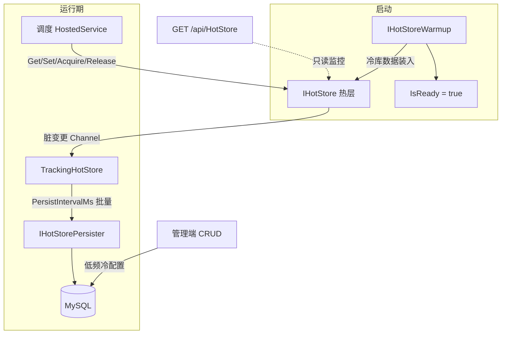

# 热数据通道（HotStore）

面向路径占用、交通管制、车辆实时状态等 **高频读写** 场景。热层为运行时真相源：启动预热后不再依赖「缓存未命中 → 查库」；写操作标记脏数据后 **异步批量落库**，与 `ICacheService`（菜单/字典等读多写少）职责分离。

相关开关见 [14-功能开关](./14-功能开关.md)；部署变量见 [07-部署指南](./07-部署指南.md)。

---

## 1. 为什么需要 HotStore

| 问题 | 用 `ICacheService` / 生成 CRUD 的后果 | HotStore 做法 |
|------|--------------------------------------|---------------|
| 路径/流量每拍读写 | 写后延迟双删 → 持续 miss → 等同打库 | 热层即真相源，运行期不回源 |
| 流量表频繁增删改 | EF 逐条 `SaveChanges` + 审计放大 | 热层改占用；DB 按节拍批量快照 |
| 冷启动第一次读 | 可接受 | `WarmupOnStartup` 就绪后再跑调度 |
| 节点/边互斥 | 无原子占用原语 | `TryAcquireAsync` / `ReleaseAsync` |

**反模式**：不要把路径/流量做成 `Get → miss → DB → Set` + 延迟双删；不要让调度节拍调用生成页 REST。

---

## 2. 实现思路

### 2.1 热冷分层

| 层级 | 存什么 | 读写方式 |
|------|--------|----------|
| **热** | 路网运行时副本、节点/边占用、车辆实时状态 | `IHotStore`（Memory 或 Redis） |
| **冷** | 地图版本、任务单、历史轨迹、占用快照 | EF / 生成 CRUD；由 `IHotStorePersister` 批量写入 |



### 2.2 代码结构

| 位置 | 职责 |
|------|------|
| `Seven.Application/Interfaces/IHotStoreServices.cs` | `IHotStore`、`IHotStoreWarmup`、`IHotStorePersister`、`HotStoreChange` |
| `Seven.Infrastructure/Configuration/AppOptions.cs` | `FeatureOptions.HotStore`、`HotStoreOptions` |
| `Seven.Infrastructure/HotStore/MemoryHotStore.cs` | 进程内强类型存储 + 内存锁 |
| `Seven.Infrastructure/HotStore/RedisHotStore.cs` | Redis JSON + Lua 占用 |
| `Seven.Infrastructure/HotStore/TrackingHotStore.cs` | 装饰器：写操作推入脏数据 Channel |
| `Seven.Infrastructure/HotStore/HotStoreHostedService.cs` | 预热 + 按节拍落库 |
| `Seven.Infrastructure/HotStore/HotStoreServiceCollectionExtensions.cs` | `AddSevenHotStore` DI |
| `Seven.Infrastructure/HotStore/Demo/*` | 四向车 Demo（可选） |
| `Seven.Infrastructure/Persistence/AuditSaveChangesInterceptor.cs` | `AuditExcludeEntities` 跳过热表审计 |
| `Seven.WebApi/Controllers` → `HotStoreController` | status / get |

注册入口：`AddSevenInfrastructure` → `AddSevenHotStore`（`DependencyInjection.cs`）。

### 2.3 运行时行为

1. **`Features.HotStore=false`**：注册 `DisabledHotStore`（写操作抛异常）；不启动预热/落库宿主。
2. **`Features.HotStore=true`**：按 `Provider` 创建 Memory 或 Redis 实现，外包 `TrackingHotStore`。
3. **预热**：`HotStoreHostedService` 依次执行全部 `IHotStoreWarmup`，超时见 `WarmupTimeoutSeconds`，然后 `MarkReady`。
4. **读写**：业务只打热层；`Get` 未命中返回 `default`，**不查库**。
5. **落库**：`Set` / `Remove` / 成功的 `Acquire` / `Release` 写入 Channel；每隔 `PersistIntervalMs` 取出最多 `PersistBatchSize` 条，调用全部 `IHotStorePersister`。
6. **审计**：落库实体短名或表名命中 `AuditExcludeEntities` 时不写 `Sys_Log` 字段审计。

### 2.4 Provider 选择

| Provider | 适用 | 注意 |
|----------|------|------|
| `Memory`（默认） | 单活调度进程 | 多实例会状态分裂 |
| `Redis` | 多实例共享占用 | 需连接串；`TryUpdateAsync` 为 get+set，强一致场景优先用 `TryAcquireAsync` |

`SingleWriter=true` 表示框架假定单写者；多活时业务需选主，避免双写占用。

---

## 3. 配置

在 `Seven.WebApi/appsettings.json`（或环境变量）：

```json
"Features": {
  "HotStore": true
},
"HotStore": {
  "Provider": "Memory",
  "RedisConnectionString": "127.0.0.1:6379",
  "KeyPrefix": "hot:",
  "WarmupOnStartup": true,
  "WarmupTimeoutSeconds": 30,
  "PersistEnabled": true,
  "PersistIntervalMs": 1000,
  "PersistBatchSize": 200,
  "DefaultTtlSeconds": 0,
  "AuditExcludeEntities": [ "TrafficOccupancy", "PathRuntime", "VehicleRealtime" ],
  "SingleWriter": true,
  "EnableDemoScheduler": false
}
```

| 配置项 | 默认 | 说明 |
|--------|------|------|
| `Provider` | Memory | `Memory` / `Redis` |
| `RedisConnectionString` | 空则回退 `Cache:RedisConnectionString` | Redis 时必填其一 |
| `KeyPrefix` | `hot:` | 与 `menu:` / `dict:` 隔离；业务 key 可写短名，存储时自动加前缀 |
| `WarmupOnStartup` | true | 启动执行已注册的 `IHotStoreWarmup` |
| `WarmupTimeoutSeconds` | 30 | 预热总超时 |
| `PersistEnabled` | true | false 时丢弃脏标记（仅热层） |
| `PersistIntervalMs` | 1000 | 落库节拍 |
| `PersistBatchSize` | 200 | 每批最大变更数 |
| `DefaultTtlSeconds` | 0 | 0=不过期（靠显式删除/释放） |
| `AuditExcludeEntities` | `[]` | 实体短名或表名，跳过审计 |
| `SingleWriter` | true | 单活写入约定 |
| `EnableDemoScheduler` | false | 注册四向车 Demo（生产保持 false） |

环境变量示例：

```bash
Features__HotStore=true
HotStore__Provider=Redis
HotStore__RedisConnectionString=redis:6379
HotStore__EnableDemoScheduler=false
```

**AND 约定**：仅当 `Features.HotStore=true` 时注册真实热层与宿主；细节节在启用后生效。

---

## 4. 使用方式（业务接入）

### 4.1 步骤概览

1. 打开 `Features.HotStore`，按需配置 `HotStore` 节。
2. 实现并注册 **预热**（冷库 → 热层）。
3. 实现并注册 **落库器**（脏变更 → 批量 UPSERT）。
4. 实现 **调度 HostedService**：等待 `IsReady`，再寻路 / 占道。
5. 管理端用 Builder 管冷表；监控可读 `GET /api/HotStore/*`，勿用 CRUD 改热状态。

### 4.2 预热 `IHotStoreWarmup`

```csharp
using Seven.Application.Interfaces;

public sealed class ShuttleMapWarmup : IHotStoreWarmup
{
    private readonly SevenDbContext _db; // 若需 Scoped 依赖，见下方注册说明

    public string Name => "ShuttleMap";

    public async Task WarmupAsync(IHotStore store, CancellationToken ct)
    {
        // 从冷库加载最新地图版本
        // var map = await _db.Maps.AsNoTracking()...
        await store.SetAsync("wcs:map", map, cancellationToken: ct);
        foreach (var node in map.Nodes)
            await store.SetAsync($"wcs:node:{node.Id}", node, cancellationToken: ct);
    }
}
```

注册（在 `Program.cs` 或业务 DI 扩展中，且 **HotStore 已启用**）：

```csharp
// 无 Scoped 依赖时可用 Singleton
services.AddSingleton<IHotStoreWarmup, ShuttleMapWarmup>();

// 需要 DbContext 时用 Scoped；宿主会 CreateScope 解析
services.AddScoped<IHotStoreWarmup, ShuttleMapWarmup>();
```

> 宿主对每个 warmup 使用 `IServiceScope`，因此 **Scoped 预热/落库均可**。Demo 使用 Singleton 仅因无 DB 依赖。

### 4.3 落库 `IHotStorePersister`

```csharp
public sealed class TrafficOccupancyPersister : IHotStorePersister
{
    private readonly SevenDbContext _db;
    public string Name => "TrafficOccupancy";

    public async Task PersistBatchAsync(IReadOnlyList<HotStoreChange> changes, CancellationToken ct)
    {
        var mine = changes.Where(c =>
            c.Key.StartsWith("wcs:lock:", StringComparison.OrdinalIgnoreCase) ||
            c.Key.StartsWith("wcs:node:", StringComparison.OrdinalIgnoreCase)).ToList();
        if (mine.Count == 0) return;

        // 按 Kind 合并：Acquire/Release/Set → 批量 UPSERT 占用快照表
        // 实体名加入 HotStore:AuditExcludeEntities，避免审计写放大
        await _db.SaveChangesAsync(ct);
    }
}

// DI
services.AddScoped<IHotStorePersister, TrafficOccupancyPersister>();
```

`HotStoreChange` 字段：

| 字段 | 含义 |
|------|------|
| `Key` | 业务传入的 key（未强制带 `KeyPrefix`；存储层会加前缀） |
| `Kind` | `Set` / `Remove` / `Acquire` / `Release` |
| `Value` | `Set` 时的对象；占用类可能为 null |
| `OwnerId` | `Acquire` / `Release` 的占用者 |
| `Timestamp` | UTC 时间 |

### 4.4 调度循环（推荐模式）

```csharp
public sealed class ShuttleSchedulerHostedService : BackgroundService
{
    private readonly IHotStore _store;

    protected override async Task ExecuteAsync(CancellationToken stoppingToken)
    {
        while (!stoppingToken.IsCancellationRequested && !_store.IsReady)
            await Task.Delay(50, stoppingToken);

        while (!stoppingToken.IsCancellationRequested)
        {
            var vehicleId = "V-001";
            var nodeLock = "wcs:lock:N12";

            if (await _store.TryAcquireAsync(nodeLock, vehicleId, TimeSpan.FromSeconds(30), stoppingToken))
            {
                await _store.TryUpdateAsync<NodeState>($"wcs:node:N12", n =>
                {
                    n ??= new NodeState { NodeId = "N12" };
                    n.OwnerId = vehicleId;
                    n.Free = false;
                    return n;
                }, stoppingToken);

                // ... 下发车辆指令、等待反馈 ...

                await _store.ReleaseAsync(nodeLock, vehicleId, stoppingToken);
            }

            await Task.Delay(100, stoppingToken);
        }
    }
}
```

### 4.5 `IHotStore` API 一览

| 方法 | 行为 |
|------|------|
| `IsReady` | 预热完成前调度应等待 |
| `GetAsync<T>` | 读热层；未命中 `default`，不回库 |
| `SetAsync<T>` | 写热层并标记脏数据 |
| `TryUpdateAsync<T>` | 读改写；Memory 按 key 互斥 |
| `RemoveAsync` | 删热层并标记脏数据 |
| `TryAcquireAsync` | 原子占用；同 owner 可重入；他主占用则 false |
| `ReleaseAsync` | 仅 owner 匹配时释放 |

注入：`IHotStore`（关闭功能时为 `DisabledHotStore`，写会抛 `InvalidOperationException`）。

### 4.6 与管理端 / 告警协作

- **冷配置**（地图主数据、任务头）：Builder 生成 CRUD，低频变更；变更后可触发重新预热或热更新接口（业务自建）。
- **热监控**：`GET /api/HotStore/status`、`GET /api/HotStore/get?key=`。
- **告警**：冲突/堵死/超时继续用 [09-告警](./09-告警模块.md) + [10-消息队列](./10-消息队列指南.md)，不要塞进 HotStore。
- **前端**：`useFeatureStore().flags.hotStore` 与后端 `Features.HotStore` 对齐（`GET /api/config/features`）。

---

## 5. HTTP API

| 方法 | 权限 | 说明 |
|------|------|------|
| `GET /api/config/features` | 匿名 | 含 `hotStore` 布尔字段 |
| `GET /api/HotStore/status` | 匿名 | `ready`、`provider`、落库/Demo 等摘要；未启用返回错误文案 |
| `GET /api/HotStore/get?key=` | `HotStore.Search` | 监控读热值 |

`status` 示例：

```json
{
  "status": true,
  "data": {
    "ready": true,
    "provider": "Memory",
    "keyPrefix": "hot:",
    "warmupOnStartup": true,
    "persistEnabled": true,
    "persistIntervalMs": 1000,
    "singleWriter": true,
    "enableDemoScheduler": false
  }
}
```

---

## 6. Demo（可选）

验证通道是否工作，本地可临时打开：

```json
"Features": { "HotStore": true },
"HotStore": {
  "Provider": "Memory",
  "EnableDemoScheduler": true,
  "PersistEnabled": true
}
```

将自动注册：

| 类型 | 作用 |
|------|------|
| `WcsMapWarmup` | 写入简易路网 `wcs:map` 与节点状态 |
| `WcsTrafficPersister` | 过滤含 `wcs:` 的变更，打 Debug 日志（不写真实表） |
| `WcsDemoSchedulerHostedService` | 就绪后循环占/放 `N1`→`N5` |

代码目录：`Seven.Infrastructure/HotStore/Demo/`。  
**生产务必** `EnableDemoScheduler=false`，用自己的预热、落库与调度替换。

验证：

1. 启动 API，看日志 `HotStore is ready` / `WCS demo scheduler started`。
2. 访问 `GET /api/HotStore/status` → `ready: true`。
3. （可选）授权后 `GET /api/HotStore/get?key=wcs:map`。

---

## 7. 实践建议与边界

1. **Key 约定**：按聚合前缀划分，如 `wcs:map`、`wcs:node:{id}`、`wcs:lock:{id}`，便于 Persister 过滤。
2. **路径结果**：任务级一次写入冷库；运行中改道只改热层。
3. **崩溃恢复**：异步落库有窗口；重启靠预热 + 车辆位置上报重算占用（业务实现）。
4. **多实例**：Memory 仅单活；多活用 Redis，并保证单写调度或接受 Lua 锁语义。
5. **不要**把主数据（菜单/字典）放进 HotStore；继续用 `ICacheService`。
6. **不要**对热表开全量字段审计；配置 `AuditExcludeEntities`。
7. 单元测试参考：`Seven.Tests/Unit/HotStoreTests.cs`、`AuditExcludeTests.cs`。
8. DeviceComm 规则可选把点位快照写入热层（需本模块开启且热层就绪），见 [16](./16-设备通讯DeviceComm.md)；**不要**用 HotStore 替代 PLC 通讯引擎。

---

## 8. 相关文档

| 文档 | 关联 |
|------|------|
| [02-后端开发指南](./02-后端开发指南.md) | 分层与 `HotStore/` 目录 |
| [14-功能开关](./14-功能开关.md) | `Features.HotStore` |
| [07-部署指南](./07-部署指南.md) | 环境变量 |
| [09-告警模块](./09-告警模块.md) / [10-消息队列](./10-消息队列指南.md) | WCS 抛警集成 |
| [16-设备通讯DeviceComm](./16-设备通讯DeviceComm.md) | 规则 Emit 可选写热层 |
| [01-快速开始](./01-快速开始.md) | 本地启动与 Features 示例 |
