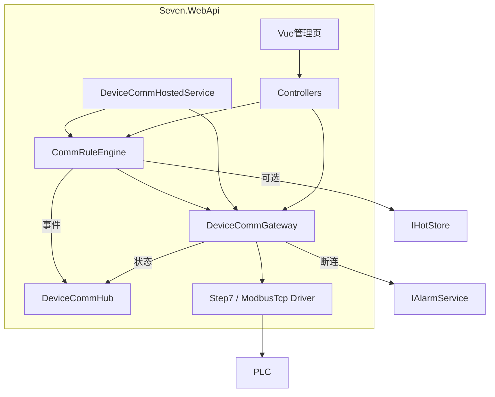

# 设备通讯（DeviceComm）

面向 PLC / 工业设备的 **进程内通讯引擎**：支持 Step7（以太网）与 Modbus TCP；统一连接生命周期（连/断/重连、失败重试、断连自动重连）；声明式组合事件规则；后台可配置连接、点位、规则。

相关开关见 [14-功能开关](./14-功能开关.md)；部署变量见 [07-部署指南](./07-部署指南.md)。实时状态配合 [SignalR / 前端](./03-前端开发指南.md)；断连告警配合 [09-告警模块](./09-告警模块.md)；规则可选写热值见 [15-热数据HotStore](./15-热数据HotStore.md)。

---

## 1. 为什么需要 DeviceComm

| 问题 | 用业务 `Device` CRUD / 业务里直连 PLC 的后果 | DeviceComm 做法 |
|------|---------------------------------------------|-----------------|
| 连接生命周期 | 业务散落 Open/Close，难统一重试/重连 | 网关状态机 + HostedService |
| 同连接并发读写 | 驱动层竞态、PLC 拒连 | 每连接 `SemaphoreSlim` 串行 IO |
| 监控多 DB / 写后读应答 | 业务 if-else 堆叠 | JSON 规则：Monitor / WriteThenAwait / Sequence |
| 运行态可视 | 无或各自打日志 | 运行态页 + SignalR `ConnectionStatus` / `RuleEvent` |
| 多实例 WebApi | 双写 PLC | `SingleWriter` 约定（首期单活） |

**反模式**：不要把协议参数硬编码进业务 Service；不要用生成页 `Device` Demo 表当 PLC 连接配置；不要在多个 API 实例同时开 `Features.DeviceComm` 而不选主。

现有 `Device` / `SubDevice` **不含协议栈**，仅业务主数据 Demo。通讯主数据使用独立表，可选 `BizDeviceId` 弱关联。

---

## 2. 实现思路

### 2.1 分层与运行时



| 位置 | 职责 |
|------|------|
| `Seven.Application/Interfaces/IDeviceCommServices.cs` | `IDeviceCommGateway`、`ICommRuleEngine`、CRUD、规则 DSL DTO |
| `Seven.Domain/Entities/DeviceComm/`、`Enums/DeviceCommEnums.cs` | 实体与协议/状态/数据类型枚举 |
| `Seven.Infrastructure/DeviceComm/` | 驱动、网关、规则引擎、HostedService、CRUD、DI |
| `Seven.Infrastructure/Configuration/AppOptions.cs` | `FeatureOptions.DeviceComm`、`DeviceCommOptions` |
| `Seven.WebApi/Controllers/DeviceCommControllers.cs` | CRUD + 运行态 API（`[RequiresFeature("DeviceComm")]`） |
| `Seven.WebApi/Hubs/DeviceCommHub.cs` | SignalR 推送实现 |
| `Seven.Vue3/src/views/DeviceComm/` | 连接 / 点位 / 规则 / 运行态 |
| `Seven.Vue3/src/extension/DeviceComm/` | 扩展（如规则「触发」按钮） |

注册入口：`AddSevenInfrastructure` → `AddSevenDeviceComm`（对齐 HotStore）。

### 2.2 数据表

| 表 | 职责 |
|----|------|
| `CommConnection` | 协议、Host、Port、启用、AutoConnect；Step7：Rack/Slot/CpuType；Modbus：UnitId |
| `CommPoint` | 点位 `Code`（全局唯一）、数据类型、地址（字符串 + 结构化字段） |
| `CommRule` | 启用、`DefinitionJson`、可选 EventName / 扫描周期覆盖 |
| `CommEventLog` | 规则触发流水（快照 JSON、成功标记） |

迁移：`Persistence/Migrations/*_AddDeviceComm.cs`。

### 2.3 开关与运行时行为

1. **`Features.DeviceComm=false`**：注册 `DisabledDeviceCommGateway` / `DisabledCommRuleEngine`；**不**启动 `DeviceCommHostedService`；API `[RequiresFeature]` → 404；前端隐藏通讯菜单。
2. **`true`**：单例网关 + 规则引擎 + HostedService；`Program` 在 `Features.SignalR && Features.DeviceComm` 时 `MapHub<DeviceCommHub>("/hub/devicecomm")`。
3. **细节节 `DeviceComm`** 与 Features 为 **AND**（超时、重试、重连、扫描周期、断连告警码等）。

### 2.4 连接与 IO

- 状态机：`Disconnected → Connecting → Connected → Faulted → Reconnecting`。
- 每连接独立驱动 + **串行 IO**。
- 读写失败：`Retry.MaxAttempts` / `BackoffMs`（按次递增退避）。
- 断连自动重连：`Reconnect.Enabled`，间隔从 `IntervalMs` 指数增大至 `MaxIntervalMs`；可选 `IAlarmService.RaiseAsync`（默认码 `DEV001`）。
- **`SingleWriter=true`**：假定单 WebApi 进程跑通讯。

### 2.5 规则引擎

宿主按 `RuleScanIntervalMs` 调用 `ICommRuleEngine.ScanOnceAsync`：

| type | 行为 | 触发方式 |
|------|------|----------|
| `Monitor` | 周期读监控点，条件满足 Emit | 自动扫描 |
| `MonitorThenRead` | 监控满足后再读一组点，打包 Emit | 自动扫描 |
| `WriteThenAwait` | 先写，再轮询 Await 直至条件或超时 | `triggerRule` / 规则页「触发」 |
| `Sequence` | Read/Write/Delay/Condition/Emit 步进 | `triggerRule` / 「触发」 |

条件算子：`eq/ne/gt/gte/lt/lte/changed/rising/falling`；组合：`conditionMode` = `all` | `any`。

Emit：写 `CommEventLog` + SignalR `RuleEvent`；可选 `raiseAlarm`；可选写 HotStore（需 `Features.HotStore` 且热层就绪，或规则 `emit.writeHotStore`）。

---

## 3. 配置

在 `Seven.WebApi/appsettings.json`（或环境变量）：

```json
"Features": {
  "DeviceComm": true,
  "SignalR": true,
  "Alarm": true
},
"DeviceComm": {
  "SingleWriter": true,
  "DefaultConnectTimeoutMs": 3000,
  "DefaultIoTimeoutMs": 2000,
  "Retry": { "MaxAttempts": 3, "BackoffMs": 500 },
  "Reconnect": { "Enabled": true, "IntervalMs": 5000, "MaxIntervalMs": 60000 },
  "RuleScanIntervalMs": 200,
  "EnableAlarmOnDisconnect": true,
  "AlarmCodeDisconnect": "DEV001",
  "WriteHotStoreOnPointChange": false
}
```

| 项 | 默认 | 说明 |
|----|------|------|
| `SingleWriter` | true | 单活约定；多实例勿双开 |
| `Retry.MaxAttempts` | 3 | 单次读写最大尝试次数 |
| `Retry.BackoffMs` | 500 | 基础退避（× attempt） |
| `Reconnect.Enabled` | true | 期望在线时自动重连 |
| `Reconnect.IntervalMs` | 5000 | 初始重连间隔 |
| `Reconnect.MaxIntervalMs` | 60000 | 重连间隔上限 |
| `RuleScanIntervalMs` | 200 | 规则扫描节拍 |
| `EnableAlarmOnDisconnect` | true | 重连失败等场景抛告警 |
| `AlarmCodeDisconnect` | DEV001 | 见 `appsettings.Alarm.json` / [09](./09-告警模块.md) |
| `WriteHotStoreOnPointChange` | false | 全局：规则 Emit 时是否镜像热层 |

```bash
Features__DeviceComm=true
DeviceComm__RuleScanIntervalMs=200
DeviceComm__Reconnect__IntervalMs=5000
```

**AND 约定**：仅 `Features.DeviceComm=true` 时注册真实引擎与宿主。

首次启用：执行 EF 迁移（含 `AddDeviceComm`）→ 重启 → 种子幂等补充菜单（通讯连接 / 点位 / 规则 / 运行态）→ 角色勾选 Auth。

---

## 4. 使用方式

### 4.1 最小闭环

1. `Features.DeviceComm=true`（建议 `SignalR` / `Alarm`），迁移并重启。
2. **通讯连接**  
   - Step7：`protocol=1`，Port `102`，Rack/Slot，`cpuType`=`S71200`/`S71500`/…  
   - Modbus TCP：`protocol=2`，Port `502`，`unitId`
3. **通讯点位**：`code` 全局唯一  
   - Step7 地址：`DB1.DBW0` / `DB1.DBX0.0`，或填 `dbNumber`+`byteOffset`(+`bitOffset`)  
   - Modbus：`HR:0`、`Coil:1`、`IR:10`、`DI:2`（也可用 `modbusArea`+`modbusAddress`）
4. 运行态页 **连接**，或 `POST /api/DeviceComm/connect/{id}`。
5. 试读写：`/api/DeviceComm/read`、`/write`、`/readRaw`、`/writeRaw`。
6. 配置规则 JSON 并启用；Monitor 类自动跑；WriteThenAwait/Sequence 点「触发」。
7. 运行态页订阅 Hub，或业务侧连 `/hub/devicecomm`。

### 4.2 前端页面

| 菜单 Url | 视图 | 说明 |
|----------|------|------|
| `/DeviceComm/CommConnection` | `views/DeviceComm/CommConnection.vue` | 连接 CRUD |
| `/DeviceComm/CommPoint` | `CommPoint.vue` | 点位 CRUD |
| `/DeviceComm/CommRule` | `CommRule.vue` | 规则 CRUD + 行内触发 |
| `/DeviceComm/Runtime` | `Runtime.vue` | 状态表、连断重连、Hub 事件 |

侧边栏为独立顶级目录 **「设备通讯」**（种子 `DeviceCommFolder`）；`Features.DeviceComm=false` 时整组隐藏。已挂在「系统管理」下的旧菜单会在启动种子时迁移归类。

`useFeatureStore().flags.deviceComm` 与后端对齐；TableName：`CommConnection` / `CommPoint` / `CommRule` / `DeviceComm` / `DeviceCommFolder`。

### 4.3 业务代码注入

```csharp
public class MyService
{
    private readonly IDeviceCommGateway _comm;

    public MyService(IDeviceCommGateway comm) => _comm = comm;

    public async Task DoAsync(CancellationToken ct)
    {
        if (!_comm.IsEnabled) return;
        var values = await _comm.ReadPointsAsync(new[] { 1, 2 }, ct);
        await _comm.WritePointsAsync(new[]
        {
            new CommWritePointRequest { CommPointId = 3, Value = true }
        }, ct);
    }
}
```

规则主动触发：注入 `ICommRuleEngine` → `TriggerAsync(ruleId)`。

---

## 5. 规则 DSL 与模板

### 5.1 JSON 字段

| 字段 | 说明 |
|------|------|
| `type` | `Monitor` / `MonitorThenRead` / `WriteThenAwait` / `Sequence` |
| `monitor` / `await` | `{ point, op, value }[]`，`point` 为点位 **Code** |
| `read` | 点位 Code 列表 |
| `write` | `{ point, value }[]` |
| `conditionMode` | `all`（默认）/ `any` |
| `awaitTimeoutMs` | WriteThenAwait 超时 |
| `emit` | `{ eventName, raiseAlarm?, alarmCode?, writeHotStore?, hotStoreKeyPrefix? }` |
| `steps` | Sequence 专用 |

### 5.2 MonitorThenRead

```json
{
  "type": "MonitorThenRead",
  "monitor": [{ "point": "ReqFlag", "op": "rising", "value": true }],
  "read": ["ReqId", "ReqQty"],
  "conditionMode": "all",
  "emit": { "eventName": "InboundRequest" }
}
```

### 5.3 WriteThenAwait

```json
{
  "type": "WriteThenAwait",
  "write": [{ "point": "CmdStart", "value": true }],
  "await": [{ "point": "CmdDone", "op": "eq", "value": true }],
  "awaitTimeoutMs": 5000,
  "emit": { "eventName": "CmdFinished", "raiseAlarm": false }
}
```

### 5.4 Sequence

```json
{
  "type": "Sequence",
  "steps": [
    { "action": "Write", "writes": [{ "point": "Lock", "value": 1 }] },
    { "action": "Delay", "delayMs": 100 },
    { "action": "Read", "points": ["Status"] },
    { "action": "Condition", "conditions": [{ "point": "Status", "op": "eq", "value": 2 }], "conditionMode": "all" },
    { "action": "Emit", "emit": { "eventName": "Ready" } }
  ]
}
```

---

## 6. API / Hub / 权限

| 方法 | 路径 | 权限 | 说明 |
|------|------|------|------|
| POST | `/api/CommConnection/getPageData` 等 | `CommConnection.*` | 连接 CRUD |
| POST | `/api/CommPoint/*` | `CommPoint.*` | 点位 CRUD |
| POST | `/api/CommRule/*` | `CommRule.*` | 规则 CRUD |
| POST | `/api/CommRule/eventLogs` | `CommRule.Search` | 触发日志分页 |
| GET | `/api/DeviceComm/status` | `DeviceComm.Search` | 连接运行态列表 |
| POST | `/api/DeviceComm/connect/{id}` | `DeviceComm.Update` | 连接 |
| POST | `/api/DeviceComm/disconnect/{id}` | `DeviceComm.Update` | 断开 |
| POST | `/api/DeviceComm/reconnect/{id}` | `DeviceComm.Update` | 重连 |
| POST | `/api/DeviceComm/read` | `DeviceComm.Search` | body: `int[]` 点位 Id |
| POST | `/api/DeviceComm/write` | `DeviceComm.Update` | body: `{ commPointId, value }[]` |
| POST | `/api/DeviceComm/readRaw` | `DeviceComm.Search` | `{ commConnectionId, address, dataType, quantity }` |
| POST | `/api/DeviceComm/writeRaw` | `DeviceComm.Update` | 同上 + `value` |
| POST | `/api/DeviceComm/reload` | `DeviceComm.Update` | 重载连接与规则缓存 |
| POST | `/api/DeviceComm/triggerRule/{id}` | `DeviceComm.Update` | 主动触发规则 |
| Hub | `/hub/devicecomm` | JWT | `ConnectionStatus`、`RuleEvent` |

Hub JWT：与告警一致，Query `access_token` 已支持路径 `/hub/devicecomm`。

Swagger 分组：运行态 Controller 为 `ops`。

---

## 7. 故障排查

| 现象 | 排查 |
|------|------|
| API 404 | `Features.DeviceComm`；是否已迁移 |
| 菜单不显示 | `flags.deviceComm`；角色 Auth；种子是否写入菜单 |
| 连不上 | 网络/端口；Step7 Rack/Slot/CpuType；Modbus UnitId |
| 地址错 | Step7 `DB*.DBX/DBB/DBW/DBD`；Modbus `HR:n` 等形式 |
| 重连风暴 | 加大 `Reconnect` 间隔；查物理链路 |
| 多实例乱 | 仅一台开 DeviceComm / 选主 |
| Hub 无推送 | `Features.SignalR`；Token；运行态页是否已 start Hub |
| 规则不触发 | 规则 Enabled；点位 Code 是否匹配；Monitor 用 rising 需边沿；WriteThenAwait 是否已 trigger |
| 断连无告警 | `EnableAlarmOnDisconnect`；`appsettings.Alarm.json` 含 DEV001；`Features.Alarm` |

单元测试参考：`Seven.Tests/Unit/DeviceCommDriverTests.cs`（地址解析、Disabled 网关）。

---

## 8. 代码入口速查

| 文件 | 说明 |
|------|------|
| `DeviceCommServiceCollectionExtensions.cs` | `AddSevenDeviceComm` |
| `DeviceCommGateway.cs` | 连接状态机、重试、重连、读写 |
| `CommRuleEngine.cs` | 规则解释与 Emit |
| `DeviceCommHostedService.cs` | 自动连接、重连、扫描 |
| `Drivers/Step7PlcDriver.cs` | S7netplus |
| `Drivers/ModbusTcpPlcDriver.cs` | NModbus TCP |

---

## 9. 相关文档

| 文档 | 说明 |
|------|------|
| [02-后端开发指南](./02-后端开发指南.md) | 分层与 `DeviceComm/` 目录 |
| [03-前端开发指南](./03-前端开发指南.md) | Features、动态路由、Hub |
| [09-告警模块](./09-告警模块.md) | DEV001 / RaiseAsync |
| [14-功能开关](./14-功能开关.md) | `Features.DeviceComm` |
| [15-热数据HotStore](./15-热数据HotStore.md) | 规则可选写热层 |
| [07-部署指南](./07-部署指南.md) | 环境变量 |
